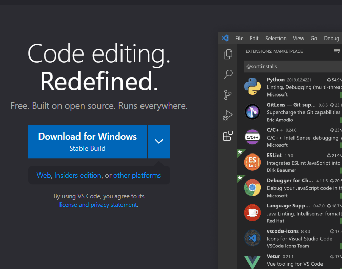
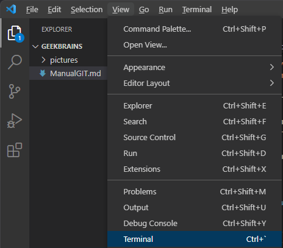
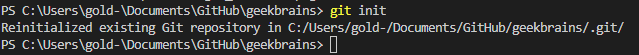
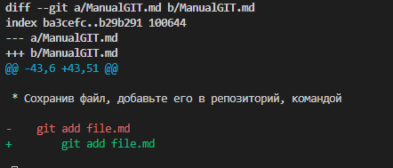
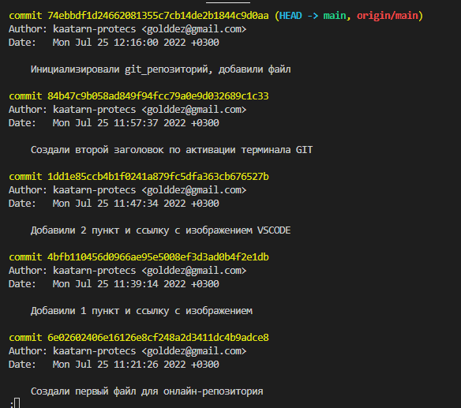

# Инструкция для работы с GIT

Для старта работы с **GIT** (системой контроля версий ваших файлов для рабочих проектов), необходимо:

* Установить программу git, используя ссылку для загрузки: [скачать GIT для Windows](https://git-scm.com/download/win)

На странице выберите подходящую версию для вашей ОС:

* Скачайте и установите редактор **VSCODE** используя ссылку:

[скачать VSCODE для Windows](https://code.visualstudio.com)

* Перезапустите компьютер и запустите редактор VSCODE

* Выберите папку для вашего будущего репозитория, через диалоговое окно *Выбор директории*

* Создайте новый файл с расширением 
**.md**

## Инициализация и работа с GIT

Активируйте терминал git через меню vscode:

Для инициализации git (*создания отслеживаемой папки*), необходимо открыть терминал и ввести команду:

    git init

Результатом работы терминала, будет сообщение о создании репозитория:

Далее, внесите изменения в ваш файл и сохраните его,
нажав `CTRL + S` или через меню **`File -> Save file`**

### Добавление файла в репозиторий

* Сохранив файл, добавьте его в репозиторий, командой

        git add file.md

вместо file.md, используйте своё имя файла, **обязательно** с расширением

* Файл добавился в отслеживание системой контроля версий. Следующим этапом будет отправка изменений в git. Для этого, введите в терминал след. команду:

        git commit -m "Текст комментария к изменению"

`-m` - *message* - комментарий к вносимым в **git** изменениям. Используется обязательно, чтобы было понятно, какие правки были внесены на этой итерации файла.

---

## Проверка состояния git

Для проверки отправленных и неотслеживаемых файлов, используется ряд команд.

1. Команда `git status`, которая выводит текущий статус системы контроля версий, зарегистрированные изменения и формирует список новых, неотслеживаемых файлов.

Пример работы команды `git status`:

    PS C:\Users\gold-\Documents\GitHub\geekbrains> git status
    On branch main
    Your branch is up to date with 'origin/main'.

    Changes not staged for commit:
    (use "git add <file>..." to update what will be committed)
    (use "git restore <file>..." to discard changes in working directory)
        modified:   ManualGIT.md    

    Untracked files:
    (use "git add <file>..." to include in what will be committed)
        pictures/git_init.png

2. Для сохранения изменений в файлах, используйте команду `git -am "Комментарий в изменениям"`

Эта команда автоматически забирает все изменения всех отслеживаемых файлов.
**Команда** `git -am`, заменяет многократный ввод команды `git commit`, для каждого отдельного файла.

3. Для добавления целых папок с файлами, в отслеживание *git*, лучше использовать команду `git add .`

ТО, мы сможем добавить все файлы, содержащиеся в текущей папке.

## Состояние файлов и логи

+ Чтобы получить разницу изменений, воспользуйтесь командой:

        git diff

В результате, вы получите разницу текущего файла и версии файла, сохраненного в репозитории:

***

+ Историю вносимых изменений, вы можете увидеть, отправив в терминал команду

        git log

Но это список последних изменениий, для получения полного списка, существует команда `git reflog`.

Работает по схожему принципу, но выводится полный список `commit`-ов, с возможностью копирования хэша изменений для дальнейшего перехода по нему в более раннее состояние файла или любое другое.

Для перехода в другую версию, необходимо использовать команду `git chechout` и ввести хеш сохранения:

    git checkout 4bfb110
